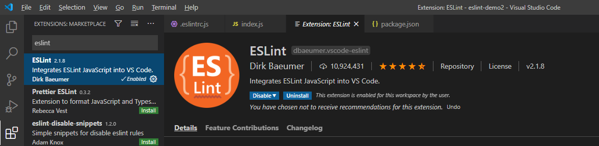
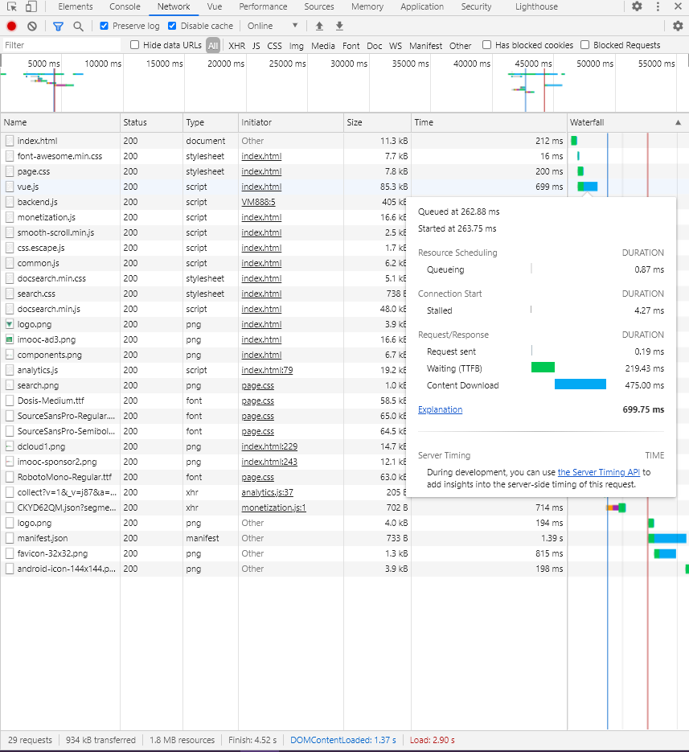

# Vue 项目配置及前端开发规范

## <span id="top">目录</span>

- [Vue CLI 2 安装](#install)
- [目录结构规范](#catalogue)
- [CSS 预处理器以及全局样式](#less)
- [ESlint + Standard 统一代码规范](#eslint)
- [UI 组件库规范](#ui)
- [ES6 兼容 IE](#es6)
- [封装 axios 和 api](#axios)
- [登录拦截](#login)
- [权限控制](#authorization)
- [Webpack](#webpack)
- [Git 规范](#git)
- [文档规范](#document)
- [性能优化](#performance)

## <span id="install">Vue CLI 2 安装</span>

参考 [github 文档](https://github.com/vuejs/vue-cli/tree/v2)

初始化项目配置参考：


[▲ 回顶部](#top)

## <span id="catalogue">目录结构规范</span>

```sh
├─ build                           # webpack 基本配置
├─ config                          # 开发环境和生产环境部分构建配置
├─ node_modules                    # node 依赖包
├─ src                             # 业务代码
  ├─ api                           # 接口
  ├─ assets                        # 图片等静态资源
  ├─ components                    # 公用组件
  ├─ library                       # 第三方库（按需）引入
  ├─ router                        # 路由
  ├─ store                         # vuex 状态管理
  ├─ styles                        # 公用样式
  ├─ views                         # 页面
  ├─ App.vue                       # 根组件
  └─ main.js                       # 入口脚本文件
├─ static                          # 不被 webpack 处理（保留）的静态资源
├─ .babelrc                        # babel 配置文件
├─ .eslintignore                   # 忽略 eslint 代码检测的配置文件
├─ .eslintrc.js                    # elsint 代码检测的配置文件
├─ index.html                      # html 入口文件
├─ package.json                    # 项目配置文件
└─ README.md                       # 项目说明文档
```

[▲ 回顶部](#top)

## <span id="less">CSS 预处理器以及全局样式</span>

CSS 预处理器是 CSS 的扩展语言，一般支持变量、嵌套、混合等编程语言的特性，使用 CSS 预处理器可以减少 CSS 冗余代码，提高编写 CSS 的效率。比较推荐的 CSS 预处理器是 [SCSS](https://www.sass.hk/guide/) 和 [Less](https://less.bootcss.com/)，这两者本质上没有太大的区别，只是语法层面的不同。

### Less 踩坑

对于 Vue CLI 2，如果安装的 Less 版本太高，可能会报错，建议安装版本：`less@3.0.4` 和 `less-loader@5.0.0`

### 全局样式

对于通用的样式，建议以全局样式进行导入（以 Less 为例）：

创建 `src/styles/reset.css`，用于统一浏览器的默认样式：

```css
/* 覆盖默认样式 */
html, body, div, span, applet, object, iframe,
h1, h2, h3, h4, h5, h6, p, blockquote, pre,
a, abbr, acronym, address, big, cite, code,
del, dfn, em, img, ins, kbd, q, s, samp,
small, strike, strong, sub, sup, tt, var,
b, u, i, center,
dl, dt, dd, ol, ul, li,
fieldset, form, label, legend,
table, caption, tbody, tfoot, thead, tr, th, td,
article, aside, canvas, details, embed,
figure, figcaption, footer, header, hgroup,
menu, nav, output, ruby, section, summary,
time, mark, audio, video {
  margin: 0;
  padding: 0;
  border: 0;
  font-size: 100%;
  font: inherit;
  vertical-align: baseline;
}
/* HTML5 display-role reset for older browsers */
article, aside, details, figcaption, figure,
footer, header, hgroup, menu, nav, section {
  display: block;
}
body {
  line-height: 1;
}
ol, ul {
  list-style: none;
}
blockquote, q {
  quotes: none;
}
blockquote:before, blockquote:after,
q:before, q:after {
  content: '';
  content: none;
}
table {
  border-collapse: collapse;
  border-spacing: 0;
}
```

创建 `src/styles/global.less`，引入 `reset.css`：

```css
@import './reset.css';

// 定义一些全局样式
```
除了覆盖默认样式，还可以在 `global.less` 中定义一些全局通用的样式。

最后在 `main.js` 中引入 `global.less`。

### 自动化导入变量、混合

对于 CSS 预处理器中，通用的变量或者混合，比如通用颜色，也建议分离成通用样式，全局样式的目录规范：

```sh
├─ src
  ├─ styles
    ├─ global.less            # 全局样式
    ├─ mixin.less             # 全局 mixin
    ├─ reset.css              # 覆盖浏览器默认样式
    ├─ variables.less         # 全局变量
```

尽管定义了通用的 `variables.less` 和 `mixin.less`，使用时仍然需要在用到的每个组件中手动导入，较为繁琐，因此需要自动化导入这些文件。

首先，安装 `sass-resources-loader`（通用）：

```sh
npm install --save-dev sass-resources-loader
```

打开 `build/utils.js` 文件，修改 `less: generateLoaders('less')`：

```js
return {
  less: generateLoaders('less').concat({
    loader: 'sass-resources-loader',
      options: {
        resources: [
          path.resolve(__dirname, '../src/styles/mixin.less'),
          path.resolve(__dirname, '../src/styles/variables.less')
        ]
      }
    })
  })
}
```

这样，在单个组件中，不需要手动导入，就可以使用 CSS 预处理器定义的全局变量和混合。

[▲ 回顶部](#top)

## <span id="eslint">ESlint + Standard 统一代码规范</span>

ESLint 是在 ECMAScript/JavaScript 代码中识别和报告模式匹配的工具，它的目标是保证代码的一致性和避免错误。统一代码规范，有助于个人养成良好的代码习惯，同时也可以降低团队开发的代码维护成本。 ESLint 的详细用法和检查规则可以参考 [官方文档](https://eslint.bootcss.com/)。

Vue CLI 初始化的时候可以选择安装 ESLint 和 Standard 代码风格，其中 `.eslintrc.js` 是 ESLint 的配置文件。

### VS Code 安装 ESLint 插件

在 VS Code 中安装 ESLint 插件，该插件会检测和应用项目中的 `.eslintrc.js`，并且在编码阶段就对不符合规则的代码作出提示，还能对错误进行修改。




修改 VS Code 的 `settings.json`（File -> Preferences -> Settings -> Text Editor -> Code Actions On Save -> Edit in settings.json），可以在保存文件的时候自动根据规则修复：

```json
{
    "editor.codeActionsOnSave": {
        "source.fixAll.eslint": true
    }
}
```

### Vue 风格指南

参考 [《Vue 风格指南》](https://cn.vuejs.org/v2/style-guide/)

[▲ 回顶部](#top)

### VS Code Code Spell Checker

VS Code 上安装 Code Spell Checker 插件，可以用于检查拼写错误，减少代码的语法错误。

## <span id="ui">UI 组件库规范</span>

UI 组件库的不做统一的要求，根据策划和设计的需求，以及项目的需要来选择，建议从常见的 UI 组件库中选择，例如：[Element UI](https://element.eleme.cn/#/zh-CN/guide/design)，[Ant Design Vue](https://www.antdv.com/docs/vue/introduce-cn/) 和 [Vant](https://vant-contrib.gitee.io/vant/#/zh-CN/) 等，这些组件库由大公司的团队在维护，较为稳定，使用群体相对比较大，有些坑别人已经踩过了。

### 踩到坑如何解决？

百度或者到官方 github 项目的 issue 中寻求解决方案。

### 按需加载

以上提到组件库的官方文档中，都会有按需加载相关的内容，建议在实际项目开发中或者后期性能优化时，实现按需加载。在开发过程中，我们一般只用到组件库中的一部分组件，如果导入整个组件库，会增加整个项目的体积，降低网站的性能。

按需引入，建议在一个单独的文件中进行全局引入，方便扩展，同时避免 `main.js` 入口文件代码混乱，以 Ant Design Vue 为例：

创建 `src/library/ant-design-vue.js`：

```js
import Vue from 'vue'
import {
  Button,
  Input
  Message
} from 'ant-design-vue'

Vue.use(Button)
Vue.use(Input)

Vue.prototype.$message = Message
```

#### Ant Design Vue 按需加载踩坑

##### 全局样式污染

按需引入组件，例如 `Button`，除了会引入该组件样式，还会引入一些全局样式，使得页面的样式不符合我们的预期，比较推荐的做法是，参考上面讲到的全局样式，引入一个 `styles/reset.css`，在组件库之后引入，对全局样式进行覆盖，同时也统一了不同浏览器下的默认样式。

##### 图标按需导入（后期优化）

即使只按需导入 `Button`， 使用 `webpack-bundle-analyzer` 打包分析工具（后面性能优化会讲到），会发现打包后的代码量仍然很大，这是因为 `Button` 组件中的 `icon` 属性默认将所有的图标引入，官方在 github 上提供的图标按需导入方法：

1.创建 `src/library/Antd/icons.js`，用于图标按需导入：

```js
export {
    default as LoadingOutline
} from '@ant-design/icons/lib/outline/LoadingOutline'
export {
    default as InfoCircleOutline
} from '@ant-design/icons/lib/outline/InfoCircleOutline'
export {
    default as CloseCircleFill
} from '@ant-design/icons/lib/fill/CloseCircleFill'

```

当使用到的组件包含图标时（例如按钮的图标，模态框的图标等），需要按导入，具体图标对应的路径参考：[https://github.com/vueComponent/pro-layout/blob/master/examples/src/core/antd/icons.js](https://github.com/vueComponent/pro-layout/blob/master/examples/src/core/antd/icons.js) 或者在 `node_modules/@ant-design/icons/lib` 目录下查找。

2.修改 `build/webpack.base.conf.js` 配置文件：

```js
module.exports = {
  resolve: {
    alias: {
      '@ant-design/icons/lib/dist$': resolve('./src/library/Antd/icons.js')
    }
  }
}
```

定义 `icons` 的解析策略，当解析 `icons` 的资源路径时，从 `./src/library/Antd/icons.js` 中进行导入，这样就实现了图标的按需导入，减少了打包体积。

##### 排除 moment 语言包

Ant Design Vue 使用 `moment`，默认会导入各种语言包，增加打包后体积，解决的办法是在生产环境的配置文件 `build/webpack.prod.conf.js` 中忽略 `moment` 语言包：

```js
const webpack = require('webpack')

module.exports = {
    plugins: [
        new webpack.IgnorePlugin(/^\.\/locale/, /moment$/)
    ]
}
```

[▲ 回顶部](#top)

## <span id="es6">ES6 兼容 IE</span>

ES6 可以分为新语法和新的 API，`let`、`const`、箭头函数，解构赋值等都属于新语法，新增的对象或者新增的方法属于新的 API，例如 `Promise` 对象，`Array.includes()` 方法。`Babel` 默认只会转换新语法，不会转换新的 API，Vue-CLI2 中使用 Webacpk3，新的 API 需要通过引入 `babel-polyfill` 来兼容环境。

首先，安装 `babel-polyfill`：

```sh
npm install --save babel-polyfill
```

然后，修改 Webpack 的入口配置：

```js
// build/webpack.base.conf.js

module.exports = {
  // entry: {
  //   app: './src/main.js'
  // },
  // ES6 兼容 IE
  entry: ['babel-polyfill', './src/main.js'],
}
```

## <span id="axios">封装 axios 和 api</span>

Vue 项目一般采用 [axios](http://www.axios-js.com/zh-cn/docs/) 进行接口请求。封装 axios 的好处：对 axios 进行统一配置，有利于项目的迭代和维护。

### 封装 axios

#### 基本配置

`axios` 的使用参考 [axios 中文文档](http://www.axios-js.com/zh-cn/docs/)。

创建 `src/api/utils/http.js`，对 axios 进行封装：

```js
import axios from 'axios'

const http = axios.create({
  baseURL: 'http:xxx', // api base_url
  timeout: 6000 // 请求超时时间
})

// 请求拦截
http.interceptors.request.use(
  config => {
    // 请求头携带Token
    // const token = localStorage.getItem('token')
    // if (token) {
    //   config.headers.Authorization = token
    // }
    return config
  },
  error => Promise.reject(error)
)

// 响应拦截
http.interceptors.response.use(
  response => Promise.resolve(response),
  error => {
    // 请求错误统一处理
    if (error.response) {
      switch (error.response.status) {
        // TODO Notification 组件提示
        case 401:
          console.log('登录过期，请重新登录')
          break
        case 403:
          console.log('拒绝访问')
          break
        case 404:
          console.log('请求不存在')
          break
        case 500:
          console.log('服务器错误')
          break
        default:
          console.log(error.response.data.message)
          break
      }
    }
    return Promise.reject(error)
  }
)

export default http
```

以上为基本的 axios 配置，可以根据实际需要进行扩展，例如，请求时统一添加签名；对于管理系统的项目，可以用 `Notification` 或者 `Modal` 组件打印错误信息，方便对线上版本修改 bug；登录过期重定向到登录页等。

#### 封装 get 和 post 请求

请求可以有多种请求方式，例如 `GET`、`POST`、`PUT`、`DELETE` 等，为了简化代码，可以对 axios 进一步封装：

```js
const http = axios.create({
  baseURL: 'http:xxx',
  timeout: 6000
})

// ...
export const get = (url, params = {}, config = {}) => {
  return http({
    url,
    method: 'GET',
    params,
    ...config
  })
}

export const post = (url, data = {}, config = {}) => {
  return http({
    url,
    method: 'POST',
    data,
    ...config
  })
}

// export default http
```

#### 环境的切换

我们的项目环境可能有开发环境、测试环境和生产环境等。可以通过 node 的环境变量动态匹配请求的 URL：

```js
const http = axios.create({
  timeout: 6000
})

// 根据环境切换请求URL
if (process.env.NODE_ENV === 'development') {
  request.baseURL = 'http://xxx:8080'
} else if (process.env.NODE_ENV === 'production') {
  request.baseURL = 'http://xxx'
}
```

### api 管理

#### 模块化管理

在 `src/api` 目录下管理 api，每个模块的 api 对应一个文件，便于扩展和维护。例如：

```sh
├─ src
  ├─ api
    ├─ utils
      └─ http.js
    ├─ course.js
    └─ user.js
```

结合之前封装 axios， 单个模块的内容可以为：

```js
// user.js
import { get, post } from './utils/http'

export const login = data => post('/user/login', data)

export const getLoginInfo = () => get('/user/info')
```

如果一个模块可以划分为更小的功能单元，则可以创建文件夹和多个文件，文件夹表示主模块，文件表示子模块。

#### 多个 api 域名

有些时候，除了区分开发环境和生产环境，我们还需要同时向不同的域名请求数据，针对这种情况，可以创建 `src/api/utils/baseURL.js`， 用于管理接口域名：

```js
const baseURL = {
  devAPI: 'http://xxx/dev/api',
  prodAPI: 'http://xxx/production/api',
  courseAPI: 'http://xxx/course/api',
  userAPI: 'http://xxx/user/api'
}

export default baseURL

```

[▲ 回顶部](#top)

## <span id="login">登录拦截</span>

### 登录拦截实现原理

1. 路由拦截，每次访问页面前，先检查本地是否有 token，如果没有，则跳转到登录页，执行第 2 步；如果有，执行第 3 步
2. 用户使用账号密码登录后，获取 token，将 token 缓存到本地
3. 所有（需要鉴权）的接口访问时，都要在请求头中携带 token
4. 携带 token 请求数据（一般是用户基本信息），如果返回 401 未授权，说明 token 过期，需要跳转到登录页，执行第 2 步

### 登录拦截实现过程

1.Vuex 封装登录状态和登录/登出接口

```js
// src/store/user.js

import { login, getLoginInfo } from '@/api/user'

const login = {
  state: {
    loginInfo: null
  },
  mutations: {
    SET_LOGIN_INFO (state, loginInfo) {
      state.loginInfo = loginInfo
    }
  },
  actions: {
    // 封装登录接口
    async Login ({ commit }, account) {
      try {
        const res = await login(account)
        if (res.data.data && res.data.data.token) {
          const token = res.data.data.data.token
          // 缓存token
          localStorage.setItem('token', `Bearer ${token}`)
        }
        return res
      } catch (error) {
        return Promise.reject(error)
      }
    },
    // 获取用户基本信息（判断token是否过期）
    async GetLoginInfo ({ commit }) {
      try {
        const res = await getLoginInfo()
        const loginInfo = res.data.data
        if (loginInfo) {
          commit('SET_LOGIN_INFO', loginInfo)
        }
        return res
      } catch (error) {
        return Promise.reject(error)
      }
    },
    // 退出登录
    async Logout ({ commit }) {
      // TODO 退出登录接口
      // 移除token
      localStorage.removeItem('token')
      commit('SET_LOGIN_INFO', null)
    }
  }
}

export default login
```

2.请求拦截和响应拦截（参考 [封装 axios 和 api](#axios)）

```js
// src/api/utils/http

// ...

// 请求拦截
http.interceptors.request.use(
  config => {
    // 请求头携带Token
    const token = localStorage.getItem('token')
    if (token) {
      config.headers.Authorization = token
    }
    return config
  },
  error => Promise.reject(error)
)

// 响应拦截
http.interceptors.response.use(
  response => Promise.resolve(response),
  error => {
    if (error.response) {
      switch (error.response.status) {
        case 401:
          console.log('登录过期，请重新登录')
          // TODO 登录过期提示
          // 重新加载当前页（结合路由守卫，可以重定向到登录页）
          window.location.reload()
          break
        // ...
      }
    }
    return Promise.reject(error)
  }
)

export default http
```

3.路由守卫，登录拦截

```js
// src/router/index.js

import Vue from 'vue'
import VueRouter from 'vue-router'
import store from '../store/index'
// ...

// hack router push callback（避免某些版本的vue-router跳转到相同页面报错）
const originalPush = VueRouter.prototype.push
VueRouter.prototype.push = function push (location, onResolve, onReject) {
  if (onResolve || onReject) {
    return originalPush.call(this, location, onResolve, onReject)
  }
  return originalPush.call(this, location).catch(err => err)
}

const routes = [
  // ...
]

const router = new VueRouter({
  routes
})

// 路由守卫，登录拦截
router.beforeEach((to, from, next) => {
  const token = localStorage.getItem('token')
  if (token) {
    if (store.state.user.loginInfo) {
      // vuex可以获取到登录状态，说明token有效
      next()
    } else {
      // 刷新页面，或者关闭页面后重新打开，vuex 失效，则重新获取
      store.dispatch('GetLoginInfo')
        .then(res => {
        // 可以获取到登录状态，说明 token 仍然有效
          next()
        })
        .catch(error => {
        // 获取失败，重新登录
          console.log(error)
          store.dispatch('Logout').then(() => {
            next('/login')
          })
        })
    }
  } else {
    // 没有token（未登录/已经退出登录），跳转到登录页
    // 如果当前要跳转的页面不是登录页，则跳转到登录页（避免死循环）
    if (to.path === '/login') {
      next()
    } else {
      next('/login')
    }
  }
})

export default router
```

4.页面中实现登录和登出

```js
// Login.vue

<script>
import { mapActions } from 'vuex'

export default {
  // ...

  methods: {
    ...mapActions(['Login']),
    async onLogin () {
      // TODO 表单校验
      try {
        await this.Login({
          // 账号密码
          // ...
        })
        // 登录成功，重定向到首页
        this.$router.push('/')
      } catch (error) {
        // TODO 错误提示
      }
    }
  }
}
</script>
```

```js
// LogoutButton.vue

<script>
import { mapActions } from 'vuex'

export default {
  // ...

  methods: {
    ...mapActions(['Logout']),
    onLogout () {
      // TODO 退出确认框
      this.Logout().then(() => {
        this.$router.push('/login')
      })
    }
  }
}
</script>
```

> `Vuex` 参考 [Vuex 官方文档](https://vuex.vuejs.org/zh/)，路由守卫参考 [Vue Router 官方文档](https://router.vuejs.org/zh/guide/advanced/navigation-guards.html#%E5%85%A8%E5%B1%80%E5%89%8D%E7%BD%AE%E5%AE%88%E5%8D%AB)，`async/await` 语法参考 [《ES6入门教程——阮一峰》](https://es6.ruanyifeng.com/)

[▲ 回顶部](#top)

## <span id="authorization">权限控制</span>

如果系统中存在多个角色，例如超级管理员和普通管理员，则不同角色对资源的访问应该进行权限控制。

### 路由权限及侧边栏

#### 路由权限

路由权限，即对角色允许访问的页面进行控制，如果角色没有权限访问当前页面，应当跳转到 404 页面。

##### 路由权限的实现思路

1. 后端应该提供 `role(Array)` 字段，前端登录后可以获取到用户所属角色；
2. 前端实现基本/通用路由表，这个路由表是静态的，包含不需要登录就可以访问的公共页面，例如：登录页、404 页面等；
3. 准备需要根据权限动态加载的路由表，这个路由表可以是前端定义，也可以是后台创建，前端定义的路由表内指定允许访问的角色列表；
4. 用户登录后，根据 `role` 比对动态路由表，筛选出可以访问的动态路由表，合并通用路由表，最终生成用户可以访问的路由表。

##### 路由权限的具体实现

1.创建通用路由表

```js
// src/router/index.js

import Vue from 'vue'
import Router from 'vue-router'
// ...

Vue.use(Router)

// 通用路由表
export const constantRouterMap = [
  {
    path: '/login',
    name: "login",
    component: Login
  },
  {
    path: '/',
    component: BasicLayout,
    redirect: '/index'
  },
  {
    path: '/404',
    name: '404',
    component: () => import('@/views/404')
  }
]

const router = new Router({
  routes: constantRouterMap
})

export default router
```

2.创建动态路由表

前端：

```js
// src/router/index.js

export const asyncRouterMap = [
  {
    path: '/',
    component: BasicLayout,
    meta: { title: '首页' },
    children: [
      {
        path: '/index',
        component: () => import('@/views/Index'),
        meta: { title: '欢迎页' }
      },
      {
        path: '/user',
        component: RouteView,
        redirect: '/user/list',
        meta: { title: '用户管理', role: ['operator'] },
        children: [
          {
            path: '/user/list',
            component: () => import('@/views/User/List'),
            meta: { title: '用户列表', role: ['operator'] }
          },
          {
            path: '/user/login',
            component: () => import('@/views/User/Login'),
            meta: { title: '登录记录', role: ['operator'] }
          }
        ]
      },
      {
        path: '/system',
        component: RouteView,
        redirect: '/system/account',
        meta: { title: '系统管理', role: ['admin'] },
        children: [
          {
            path: '/system/account',
            component: () => import('@/views/System/Account'),
            meta: { title: '账号管理', role: ['admin'] }
          }
        ]
      }
    ]
  },
  {
    path: '*',
    redirect: '/404'
  }
]
```

上面的例子包含两种角色：普通运营（operator）和超级管理员（admin），通过 `meta.role` 指定允许访问的角色，不指定时所有角色都可以访问。

最后其他未匹配到的路由，需要重定向到 404 页面。

有些时候，路由表不像上面的例子在前端配置，而是需要在后台动态配置页面/菜单信息：


3.`Vuex` 管理路由权限

```js
// src/store/permission.js

import { constantRouterMap, asyncRouterMap } from '@/router/index'

// 判断用户是否拥有当前页面的权限
function hasPermission (route, roles) {
  if (route.meta && route.meta.role) {
    return roles.some(role => route.meta.role.includes(role))
  }
  return true
}

// 根据权限过滤，获取动态路由表
function filterAsyncRouters (routerMap, roles) {
  let accessedRouters = routerMap.filter(route => {
    // 超级管理员，返回全部路由
    if (roles.includes('admin')) {
      return true
    }
    // 用户有权限
    if (hasPermission(route, roles)) {
      // 处理子路由
      if (route.children && route.children.length) {
        route.children = filterAsyncRouters(route.children, roles)
      }
      return true
    }
    return false
  })
  return accessedRouters
}

const permission = {
  state: {
    routers: constantRouterMap,
    addRouters: []
  },
  mutations: {
    SET_ROUTERS (state, routers) {
      state.addRouters = routers
      state.routers = constantRouterMap.concat(routers)
    }
  },
  actions: {
    GenerateRoutes ({ commit }, roles) {
      return new Promise(resolve => {
        // 根据role权限做筛选
        const accessedRouters = filterAsyncRouters(asyncRouterMap, roles)
        commit('SET_ROUTERS', accessedRouters)
        // TODO Vuex user中应该管理roles(Array)状态，此处略
        commit('SET_USER_ROLES', roles)
        resolve()
      })
    }
  }
}
```
`GenerateRoutes(roles [])` 函数，根据用户的角色，最终筛选出允许访问的路由表。 

4.路由守卫

路由权限控制需要基于登录功能，参考上文 [登录拦截](#login)。

```js
// src/router/index.js

router.beforeEach((to, from, next) => {
  const token = localStorage.getItem('token')
  if (token) {
    // 有token
    if (to.path === '/login') {
      next('')
    } else {
      // Vuex中无用户role，即无路由表，则重新获取角色和路由表（登录或者手动刷新页面时无路由）
      if (!store.state.user.role.length) {
        store.dispatch('GetLoginInfo').then(res => {
          const roles = res.data.roles
          // 动态分发路由
          store.dispatch('GenerateRoutes', roles)
          .then(() => {
            router.addRoutes(store.state.permission.routers)
            // hack方法，确保addRoutes已完成
            next({ ...to, replace: true })
          })
        })
      } else {
        next()
      }
    }
  } else {
    // 无token，返回登录页
    if (to.path === '/login') {
      next()
    } else {
      next('/login')
    }
  }
})

export default router
```

> Vue2.2.0 以后，可以通过 `router.addRoutes` 动态添加路由

#### 侧边栏

侧边栏基于路由权限，只有用户有权访问的页面，才会在侧边栏的菜单中出现。一般的做法是基于组件库的侧边栏/菜单组件，使用递归组件，根据路由表进行渲染。参考 [Ant-Design-Vue-导航菜单-单文件递归菜单](https://www.antdv.com/components/menu-cn/#components-menu-demo-single-file-recursive-menu)。

侧边栏一般不会显示整个路由表，而是选取 `path` 为 `'/'` 的路由的 `children`。如果不希望某个特定的路由出现在侧边栏中，可以添加 `meta.hide` 字段，渲染菜单的时候根据需要隐藏。

```js
let menus = routes.find(route => route.path === '/')
menus = (menus && menus.children) || [] 
```

侧边栏除了点击菜单显示对应页面，还应该实现：根据路由展开/高亮对应的菜单。做法是在侧边栏组件 `mounted` 生命周期触发时，以及监听（`watch`）路由变化时，比对当前路由和侧边栏，展开/高亮对应菜单。

### 接口/请求/资源权限

接口权限属于后端的范围，一般如果用户没有访问对应接口（资源）的权限，应当返回 403 状态码。有时候，系统的角色不是固定的，需要动态创建角色，因此就需要为角色动态分配权限。

系统为角色分配请求权限，应当实现以下功能模块：菜单管理（参考路由权限中从后台配置路由）、资源/请求管理（在对应模块/菜单中创建和管理不同的接口）和角色管理（创建角色和分配权限）

- 菜单管理：


- 请求管理：


- 角色管理：


### 动作权限

有时候，系统可能需要进行精细的动作权限控制，例如，某个用户是否有权限看到/点击某个按钮。

最简单的做法是，任何用户都可以看到该按钮，当用户点击按钮时，通过接口权限去控制，如果返回 403，则提示用户没有对应的权限。

另一种做法是，前端根据用户的 `role`，通过 `v-if` 或者自定义指令控制按钮的显示。

有时候，像上文接口权限中的情况一样，系统角色不固定，则需要动态配置角色的动作权限，参考上文接口权限的实现。


> 注意：同一个页面中出现过多的动作权限控制是不合理的，这时候应该考虑使用路由控制。

[▲ 回顶部](#top)

## <span id="webpack">Webpack</span>

Webpack 是一个现代 JavaScript 应用程序的静态模块打包器，是前端工程化必备的内容。

[Webpack 中文文档](https://webpack.docschina.org/concepts/)

[Webpack 英文文档](https://webpack.js.org/concepts/)

参考 Webpack 文档的指南（guides），可以快速上手。

> 注意：Vue-CLI2 默认使用的是 Webpack3，部分配置可能与新版的 Webpack 不一样。

### 开发环境和生产环境

开发环境（development）和生产环境（production）的构建目标差异很大。在开发环境中，我们需要具有强大的、具有实时重新加载（live reloading）或热模块替换（hot module replacement）能力的 source map 和 localhost server。而在生产环境中，我们的目标则转向于关注更小的 bundle，更轻量的 source map，以及更优化的资源，以改善加载时间。由于要遵循逻辑分离，我们通常建议为每个环境编写彼此独立的 webpack 配置。

Vue CLI 2 项目中，`build/` 文件夹包含了基本的 Webpack 配置，其中，`webpack.base.conf.js` 是通用的环境配置，`webpack.dev.conf.js` 是开发环境配置，`webpack.prod.conf.js` 是生产环境配置。Vue CLI 2 默认已经配置了很多 Webpack 的内容，只需要根据项目需要修改即可。


[▲ 回顶部](#top)

## <span id="git">Git 规范</span>

Git 的详细用法参考：[Git 文档](https://git-scm.com/book/zh/v2) 和 [廖雪峰 Git 教程](https://www.liaoxuefeng.com/wiki/896043488029600)

对于个人开发的项目或者小型项目，对分支管理不做太多的约束，需要定期提交代码到 Gitlab，commit message 应当清晰明了，说明清楚代码的改动，避免无意义的说明，例如：

```sh
# 不规范的写法
git commit -m "一次提交"
git commit -m "今天有点冷"

# 推荐的写法
git commit -m "课程模块新增搜索功能"
# 或者添加类别标识
git commit -m "feat: 课程模块新增搜索功能"
```

添加类型标识可以快速分辨代码提交的内容，常见的类型标识：

- feat：新功能（feature）
- fix：修改 bug
- docs：文档（document）
- style：格式（不影响代码运行的变动）
- refactor：重构（即不是新增功能，也不是修改bug的代码变动）
- test：增加测试
- chore：构建过程或辅助工具的变动
  
对于团队项目或者大型项目，需要对项目进行分支管理：

- master
主分支，主分支和线上版本保持一致，受保护，只支持合并，不允许在主分支上进行开发，每次合并需要添加 Tag 版本号。
- dev
主开发分支，可以进行 `commit`，`push` 等操作，如果有新功能的开发，则在 dev 分支的基础上继续创建子分支，完成新功能的开发，测试通过后再合并到 dev，发布正式版的时候，再合并到 master。
- release（可选）
测试分支，一般用于 bug 修复。

[▲ 回顶部](#top)

## <span id="document">文档规范</span>

文档对于项目的开发、迭代、重构和项目移交都非常重要。

使用 Markdown 作为文档格式，推荐使用 [Markdown All in One](https://segmentfault.com/a/1190000017461306) 插件进行编辑或者 Markdown Preview Enhanced 插件进行预览，前者支持预览、格式化和快捷键等功能。Markdown 的基本用法参考： [https://github.com/younghz/Markdown](https://github.com/younghz/Markdown)。

项目说明文档应该具备以下内容：

- 项目的基本功能，使用说明概述
- 代码的运行环境，启动命令等
- 项目目录结构说明
- 开发过程的关键点（踩坑或者难点）
- 接口文档地址
- 迭代记录

### 代码注释

广义的文档也包括代码注释，必要和适量的注释对阅读源代码的人来说就是一个路牌, 可以少走很多弯路。

[▲ 回顶部](#top)

## <span id="performance">性能优化</span>

### 常见性能分析工具

#### webpack-bundle-analyzer 打包分析工具

`webpack-bundle-analyzer` 插件可以将打包后的结果以矩形树图的方式进行可视化显示，方便我们进行模块分析和性能优化。

详细用法参考：[github 文档](https://github.com/webpack-contrib/webpack-bundle-analyzer)。


Vue CLI 2 自带这个插件，运行编译命令 `npm run build --report`。

编译后自动打开分析页面，可以直观看到各个模块打包后的相对大小，我们就可以有针对性地对模块进行优化。除此之外，还能看到各个模块代码的原始大小（stat）、编译后的大小（parsed）以及压缩后的大小（Gzipped）。

#### Lighthouse

使用 Google Chrome 提供的 Lighthouse 网站性能分析工具，可以对网站的性能等进行评估，并给出适当的建议。

参考 [github 文档](https://github.com/GoogleChrome/lighthouse)，通过 npm 安装到本地。

以 Vue 2.0 的官方文档为例，运行脚本 `lighthouse https://cn.vuejs.org/v2/guide/index.html`，可以在本地生成一个报告页面。


对于标红的指标，重点关注和优化。

#### Chrome Devtools

##### Network



1.基本信息

左下角也可以看出页面网络的基本信息，依次是：

- 请求总次数
- 通过网络传送资源大小（当加载浏览器缓存时，该数值会比首次加载小）
- 资源总大小
- 所有请求响应完成时间
- DOM 加载和解析完成时间（DOM 树构建完成，不包含css和图片等资源）
- 页面完全加载时间（css和图片等外部资源加载完成）

根据这些基本信息，可以对网页的网络性能有基本的评估和优化方案。提供几个参考的数据：

- 首屏请求数超过 100
- 页面首屏的资源总大小超过 5MB
- DOM 树构建时间超过 2s
- 页面完全加载时间超过 5s

当页面首次加载符合以上某个条件时，应当考虑做优化。

2.详细信息

`Size` 可以看到各资源的大小，注意二次加载会启用浏览器缓存，加载时间变短，如果只需要分析首次加载，可以按 `ctrl + F5` 强制刷新页面或者勾选上方的 `Disable cache`。

`Time` 表示资源从开始请求到下载完成所需的时间，右侧的 `Waterfall` 可以更直观地看出资源加载时间，鼠标悬停还能看到详细的信息，其中有个比较重要的指标 `Waiting(TTFB)`。

`TTFB` 首字节时间，反应了往返时间和服务器响应时间，如果 `TTFB` 超过 500ms，应当考虑做优化，比如使用 CDN 加速，从距离用户较近的站点加载资源；精简 cookie 等。

3.其他

除此之外，还有一个比较常用的功能，选择网络连接速度，默认是 `Online`，可以设置成 `Fast 3G` 或者 `Slow 3G`，模拟网络较差的情况下网页的加载情况。

##### Performance

`Performance` 可以对页面的运行情况进行录制，并生成分析报告。如果需要录制页面打开时的情况，则可以直接点击 `start` 按钮，页面加载完会自动停止录制；如果只需要录制某个片段，例如点击按钮，则可以点击 `record` 按钮，对页面进行操作之后，再点击 `stop`。


1. Summary

左下角的 `Summary` 面板，可以页面加载过程各个阶段的耗时，分别是：

- Loading：加载时间
- Scripting：JS 执行时间
- Rendering：渲染（重排）时间
- Painting：绘制（重绘）时间
- System：系统占用时间
- Idle：空闲时间

前4个指标，如果某个指标的时间过长，则应该考虑做相应的优化。

2. NET

`NET` 是录制过程的快照，可以是用于分析页面白屏的时间。

3. FPS 和 Frames
   
`FPS`（帧率）反应了页面动画的流畅程度，绿色的柱状越高，说明页面越流畅，某个片段的红线越长，说明页面越可能卡顿。

下方的 `Frames` 面板可以看到更加详细的信息。 

4. Main
  
`Main` 面板是一个火焰图，反应主线程的执行情况，是一个比较重要的部分。火焰图可以看出函数的执行时间，横向表示时间，纵向表示函数的调用栈，如果某个 `Task` 的耗时较长，右上角会标红，可以选中之后使用鼠标滚轮放大，最终定位到耗时比较多的函数，进行相应的优化。切换下方的面板，`Bottom-up`、`Call Tree` 和 `Event Log` 可以看到更多信息。

##### Coverage 和 Block Request URL 

`Coverage` 可以分析各个文件代码的使用情况，以此精细地去除无用的代码，减少打包体积。

按 `Ctrl + Shift + P` 打开控制面板，输入并选择 `Show Coverage`，点击下方的 `start` 图标，开始分析。

`Unused Bytes` 可以看到当前状态下文件代码的未使用率。

`Usage Visualization` 可以更加直观地看出使用情况。

点击某一行，还能定位到选中文件，代码行数右侧的红色部分标记当前未使用的代码。


除此之外，还能结合 `Block Request URL`，查看不加载某个文件对页面的影响，使用方法是在 `Network` 中找到相应的文件，右键，选择 `Block Request URL`。

### 图片优化

一般图片在页面中所占比重都不低，优化图片性能可以改善页面的性能。

#### 图片压缩

对于静态图片，通过压缩图片，可以减少图片资源的大小，提高网页的加载速度。常用的在线图片压缩网站有：[tinypng](https://tinypng.com/) 和 [字客网](https://en.m.fontke.com/tool/compressimage/) 等。

#### 响应式图片

响应式图片，是指在不同屏幕尺寸和分辨率的设备上都能良好显示的图片。对于不同尺寸的设备，我们趋向于使用不同的图片，让图片在不同场景下都能良好的显示效果，而且我们也没必要在小尺寸的设备中加载大图，这样会浪费带宽。


##### HTML5 \<picture> 标签

```html
<template>
  <div>
    <picture>
      <source media="(min-width: 768px)" srcset="./images/image-pc.jpg"></source>
      <source media="(max-width: 767px)" srcset="./images/image-mobile.jpg"></source>
      
    </picture>
  </div>
</template>

<style scoped>
.img {
  max-width: 100%;
}
</style>
```

`<picture>` 中包含 `<source>` ，`<source>` 通过 `media` 属性来定义媒体查询条件，当目标设备满足条件时，就会使用对应 `srcset` 指定的图片资源。`<picture>` 最后应该包含一个 ``，当所有媒体条件不满足时，会显示此图片。这里为图片指定一个 `max-width: 100%;` 的样式，确保图片能自适应显示。

##### CSS3 媒体查询和 background-image

```html
<template>
  <div class="bg"></div>
</template>

<style scoped>
.bg {
  width: 100%;
  height: 0;
  background-repeat: no-repeat;
  background-position: center center;
  background-size: cover;
}
@media screen and (min-width: 768px) {
  .bg {
    padding-bottom: 44.271%;
    background-image: url('./images/image-pc.jpg');
  }
}
@media screen and (max-width: 767px) {
  .bg {
    padding-bottom: 146.667%;
    background-image: url('./images/image-mobile.jpg');
  }
}
</style>
```

通过媒体查询，为不同尺寸的设备适配不同的背景图片，这里为图片指定了 `height: 0;` 以及 `padding-bottom`，使得元素根据背景图片的长宽比自适应显示。

#### 图片懒加载

对于长页面，有些图片不会在首屏出现，需要页面往下滚动才会看到，有时用户甚至刚打开页面就关闭或者跳转到别的页面，但是这些图片还是会被加载，这样不仅影响页面渲染速度，还会浪费带宽。图片懒加载是一种优化的策略，按需加载图片，当图片需要显示的时候才加载，避免加载多余的图片。

`vue-lazyload` 是一个常用的图片懒加载插件，详细用法参考：[github 文档](https://github.com/hilongjw/vue-lazyload)。

首先，安装插件

```sh
npm install vue-lazyload --save
```

全局引入：

```js
import Vue from 'vue'
import App from './App'
import VueLazyload from 'vue-lazyload'

Vue.use(VueLazyload)

Vue.config.productionTip = false

/* eslint-disable no-new */
new Vue({
    el: '#app',
    components: { App },
    template: '<App/>'
})
```

组件中使用，将图片的 `src` 属性替换为 `v-lazy` 或者指定 `background-image`：

```html
<template>
  <div>
    
    <div v-lazy:background-image="require('../assets/images/01.jpg')"></div>
  </div>
</template>
```

#### 使用 CSS3 取代某些图片效果

圆角、阴影、半透明颜色、渐变色等效果，可以使用对应的 CSS3 实现，而不需要另外引入图片，这样可以减少页面的请求数量，提高性能。

前端开发不同于 App 开发，App 的静态图片包含在 apk 当中，下载安装后，这些静态图片是存储在本地的，不需要额外的请求，而 web 是需要请求这些静态图片的，图片太多，页面的性能就会下降。因此，对于上述的效果，即使 UI 给到效果图，也应尽量使用 CSS3 实现。

#### 使用字体图标代替图标图片

使用字体图标代替图标图片具有以下好处：

* 减少页面图片请求，提高页面性能
* 可以方便地修改图标大小，颜色
* 图标在放大的情况下也不会失真

常用的字体图标库：[阿里巴巴矢量图标库](https://www.iconfont.cn/) 和 [Font Awesome](http://www.fontawesome.com.cn/)

使用的时候注意图标版权，阿里巴巴矢量图标库一般官方的图标库是可以免费商用，而用户上传的图标库是需要版权的，Font Awesome 中文网上 v4.7 是可以免费商用的。

字体文件放在 `src/assets` 目录下，也建议将字体图标封装成组件，提高复用性。

#### CDN 加速

CDN 就像是物流仓库。假设我们网购时，每次下单后，电商都从总仓库中取出商品发货，这样总仓库的存储压力就会很大，而且当接收地址离总仓库很远时，运输时长和运输成本就会大大提高，有时甚至快递遗失或损毁，这显然是不理想的。CDN 就像在各地建立物流仓库，当用户下单（请求资源）时，从最近的仓库发货（分发资源），提高了效率。

在实际开发中，常见的做法是将动态资源放在一个（主）站点中，将静态资源，例如图片、视频等，放在 CDN 站点（例如阿里云、腾讯云）中，利用 CDN 进行加速。

### JS优化

#### 变量缓存

先看下面的例子：

```js
for (let i = 0; i < book.length; i++) {
    console.log(book[i].press.name)
    console.log(book[i].press.address)
    console.log(book[i].press.phone)
}
```

这个例子中有一个 `for` 循环，循环遍历一个图书列表，然后打印每一本书的出版社的名称、地址和电话。在每个循环中，JS 需要多次查找 `book[i].press`。JS 查找对象的属性需要一定的性能，特别当属性的查找链比较长，或者出现在循环中时，查找重复属性的性能就会下降，解决的办法是定义一个中间变量来进行缓存。

修改上面的例子：

```js
for (let i = 0; i < book.length; i++) {
    let press = book[i].press
    console.log(press.name)
    console.log(press.address)
    console.log(press.phone)
}
```

#### 尾调用（尾递归）优化

尾调用相关参考：[《阮一峰 ES6 入门》](https://es6.ruanyifeng.com/#docs/function#%E5%B0%BE%E8%B0%83%E7%94%A8%E4%BC%98%E5%8C%96)

递归函数中，函数内部调用自身，执行期间会一直将新的栈帧推入到函数调用栈中，从而可能导致“栈溢出”。

以斐波那契数列为例，使用递归函数的实现：

```js
function Fibonacci(n) {
  if (n <= 1) return 1
  return Fibonacci(n - 1) + Fibonacci(n - 2)
}

console.log(Fibonacci(10)) // 89
console.log(Fibonacci(100)) // 超时
```

这个递归函数的调用栈的帧数的空间复杂度是 O(2<sup>n</sup>)，当 n = 100 时，栈溢出。

使用尾递归优化：

```js
function Fibonacci(n, a1 = 1, a2 = 1) {
  if (n <= 1) return a2
  return Fibonacci(n - 1, a2, a1 + a2)
}
```

函数参数保存中间变量，并且在函数最后将结果 `return`。

除了使用尾递归优化，还可以将递归函数改写成“循环”，优化性能：

```js
function Fibonacci(n) {
  let a1 = 1, a2 = 1
  for (let i = 2; i <= n; i++) {
    // 解构赋值
    [a1, a2] = [a2, a1 + a2]
  }
  return a2
}
```

#### 定时器优化

首先，应当避免定时器的滥用，比如在 `scroll` 事件中重复添加定时器。

当不需要定时器时，就应当移除定时器。

```js
let timer = null

// 添加定时器
timer = setInterval(() => {
    // 定时器内容
}, 1000)

// 不需要用定时器时，移除
clearInterval(timer)
```

在 Vue 项目中，当切换路由，即当前页面销毁之前（`beforeDestroy`），应该移除不用的定时器。

#### 移除事件监听

事件监听会占用一定的资源，当大量无用的事件监听常驻内存，就会影响页面性能。因此，当不需要某个事件监听，或者需要覆盖某个事件监听时，应当移除事件监听。

在 Vue 项目中，页面销毁时，会移除通过 `@`（`v-on`）绑定的事件，但是我们自己通过 `addEventListener` 添加的事件不会自动移除，因此需要在页面销毁之前（`beforeDestroy`）移除事件。

```js
<script>
export default {
  mounted () {
    const body = document.body
    body.addEventListener('scroll', this.clickEvent, false)
    this.$once('hook:beforeDestroy', () => {
      body.removeEventListener('scroll', this.clickEvent, false)
    })
  },
  methods: {
    clickEvent () {
      console.log(document.documentElement.scrollTop)
    }
  }
}
</script>
```

#### 函数防抖（debounce）/ 节流（throttle）

某些业务场景会频繁触发事件，例如页面滚动触发 `onscroll`、改变窗口大小触发 `onresize` 和 鼠标滑过触发 `onmousemove` 等，如果频繁触发某个事件（特别是请求或复杂的 DOM 操作），会降低页面的性能。

#### 函数防抖

函数防抖，指的是事件触发后一定事件内不重复触发，函数才会执行；如果事件持续触发，则不会执行（连续触发事件的最后一个）。

#### 函数节流

函数节流，指的是函数在指定事件间隔内只会执行一次；经过一定时间后，才会继续触发（连续触发事件的第一个）。

以函数节流为例，首先，安装 `lodash` 工具库：

```sh
npm install --save lodash
```

修改之前移除监听事件的例子，导入 `throttle`

```js
<script>
import throttle from 'lodash/throttle'

export default {
  mounted () {
    const body = document.body
    body.addEventListener('scroll', this.clickEvent, false)
    this.$once('hook:beforeDestroy', () => {
      body.removeEventListener('scroll', this.clickEvent, false)
    })
  },
  methods: {
    // 函数节流， 200 ms 内只会触发一次
    clickEvent: throttle(function () {
      console.log(document.documentElement.scrollTop)
    }, 200)
  }
}
</script>
```

#### 合理使用 LocalStorage 和 SessionStorage

对于某些用户数据，例如网站偏好设置，历史记录等，需要用户获取到之前的数据，又没有必要请求服务器，则可以使用本地缓存。

### 感知性能优化

#### 首屏优化

SPA 的首屏加载相对较慢，会出现一段时间的空白，影响用户体验，改善的办法是使用骨架屏或者 loading 加载动画。

#### 加载优化

当请求数据时，如果页面处于等待状态，没有任何反馈，用户会有页面卡顿的感觉，改善的办法是加载数据时显示 loading 动画，提示用户数据正在加载，必要时可以在数据加载失败时给以提示。

### Webpack 构建优化

Vue CLI 2 默认的 Webpack 配置，已经实现了一些前端项目的性能优化，包括但不限于：

- CSS 根据最低浏览器添加产商前缀
- 打包 CSS 和 JS 等代码，减少文件个数，从而减少请求次数
- 压缩代码，减少文件的大小
- 分离比较稳定的第三方库代码，从而利用浏览器缓存，提高页面更新时的访问速度
- 将较小的图片转化为 Base64 编码，从而减少请求次数，而且小图片转化的 Base64 解析速度比原图片快

#### externals 引入 CDN 资源

Webpack 中，我们使用框架或第三方插件，通常是通过 npm 安装之后，然后 `import` 导入，这样，这些代码库也会被打包到我们的项目中，导致打包后的文件过大。

Webpack 中，我们通过 `externals` 属性，以外部扩展的形式引入代码库，这样就可以通过 CDN 进行加速了。

以分离 vue 和 vue-router 为例：

首先，在 `index.html` 中引入对应版本的 CDN 资源：

```html
<body>
  <script src="https://cdn.jsdelivr.net/npm/vue@2.5.2/dist/vue.min.js"></script>
  <script src="https://cdn.jsdelivr.net/npm/vue-router@3.0.1/dist/vue-router.min.js"></script>
</body>
```

修改 `build/webpack.base.conf.js` 配置文件：

```js
module.exports = {
  externals: {
    vue: 'Vue',
    'vue-router': 'VueRouter'
  }
}
```

> 注意
> 如果某个第三方库支持按需导入，则优先考虑按需导入，而不是 CDN 引入。

[▲ 回顶部](#top)
